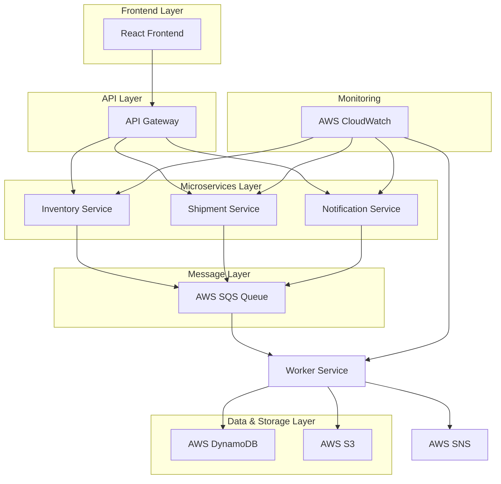

# AuraFlow - Enterprise Supply Chain Intelligence

<p align="center">
  
  
  
  
  
</p>

**Target Company:** Amazon

## 📋 Table of Contents
* [Core Concept](#-core-concept)
* [System Architecture](#️-system-architecture)
* [Key Features](#-key-features)
* [Technology Stack](#-technology-stack)
* [Engineering Challenges](#-engineering-challenges--solutions)
* [Prerequisites](#-prerequisites)
* [Getting Started](#️-getting-started)
* [Amazon-Aligned Features](#-amazon-aligned-features)

## 🌟 Core Concept

A robust, event-driven, full-stack platform for managing e-commerce supply chains, built entirely on a resilient, cloud-native architecture. This project emphasizes backend reliability, fault-tolerance, and scalable infrastructure - principles that power Amazon's global logistics network.

## 🏗️ System Architecture



This microservices architecture leverages AWS cloud services for scalability and reliability. The React frontend communicates with Spring Boot microservices through an API Gateway. Asynchronous processing is handled via SQS queues, ensuring fault tolerance and horizontal scalability.

## 📦 Key Features

- [ ] Role-based user authentication (Spring Security)
- [ ] RESTful APIs for CRUD operations on inventory and shipments
- [ ] Asynchronous job processing using AWS SQS and a separate worker service
- [ ] Microservices architecture (e.g., 'Inventory' and 'Shipment Tracking' services)
- [ ] Automated alerts (e.g., low stock warnings) via AWS SNS
- [ ] Storing large, unstructured report data in AWS S3
- [ ] A full CI/CD pipeline using GitHub Actions or AWS CodePipeline to auto-deploy changes to AWS

## ☁️ Technology Stack

| Category | Technology | Rationale |
|----------|------------|-----------|
| **Frontend** | React + TypeScript | Component-based UI with type safety, aligns with Amazon's modern web practices |
| **Backend** | Java 21 + Spring Boot 3 | Enterprise-grade, production-ready framework used widely at Amazon |
| **Database** | AWS DynamoDB | NoSQL scalability for high-throughput supply chain data |
| **Object Storage** | AWS S3 | Reliable, durable storage for reports and large datasets |
| **Message Queue** | AWS SQS | Reliable asynchronous processing, core to Amazon's architecture |
| **Notifications** | AWS SNS | Real-time alerts and notifications at scale |
| **Containerization** | Docker | Consistent deployment environments |
| **Orchestration** | AWS ECS/EKS | Container management and auto-scaling |
| **Testing** | JUnit + Mockito, React Testing Library | Comprehensive testing for enterprise reliability |
| **Infrastructure as Code** | AWS CDK (TypeScript) | Automated infrastructure provisioning and management |
| **CI/CD** | AWS CodePipeline + CloudWatch | Amazon's native DevOps ecosystem |

## 🧠 Engineering Challenges & Solutions

### **Challenge 1: Event-Driven Microservices Coordination**
* **Problem:** Ensuring data consistency across multiple microservices without distributed transactions, while maintaining high availability.
* **Solution:** Implement the Saga pattern with SQS for reliable message delivery, event sourcing for audit trails, and eventual consistency with compensating transactions for rollbacks.

### **Challenge 2: High-Throughput Asynchronous Processing**
* **Problem:** Processing thousands of inventory updates per second without blocking the main application or losing data.
* **Solution:** Use SQS with dead letter queues for failed messages, implement exponential backoff retry logic, and horizontal scaling of worker services based on queue depth metrics.

### **Challenge 3: Multi-Region Fault Tolerance**
* **Problem:** Ensuring system availability even if an entire AWS region goes down.
* **Solution:** Deploy services across multiple AWS regions with DynamoDB Global Tables for data replication, Route 53 for DNS failover, and S3 cross-region replication for backup data.

## 📋 Prerequisites

- Java 21+ and Maven 3.8+
- Node.js 18+ and npm
- AWS CLI configured with appropriate permissions
- Docker and Docker Compose
- AWS account with access to ECS, DynamoDB, SQS, SNS, S3

## 🛠️ Getting Started

1. **Clone and Setup**
   ```bash
   git clone <repository-url>
   cd AuraFlow
   ```

2. **AWS Infrastructure Setup**
   ```bash
   # Deploy AWS resources using CDK
   cd infrastructure
   npm install
   cdk bootstrap
   cdk deploy
   ```

3. **Backend Services Setup**
   ```bash
   cd services
   mvn clean install
   docker-compose up -d
   ```

4. **Frontend Setup**
   ```bash
   cd frontend
   npm install
   npm start
   ```

5. **Environment Configuration**
   ```bash
   # Configure AWS credentials
   aws configure
   # Set environment variables for services
   cp .env.example .env
   ```

## 🧪 Running Tests

- **Backend Tests:** `mvn test`
- **Frontend Tests:** `npm test`
- **Integration Tests:** `mvn verify -P integration-tests`

## 🎯 Amazon-Aligned Features

This project showcases skills directly relevant to Amazon's engineering excellence:

| Amazon Focus Area | AuraFlow Implementation | Why It Matters |
|-------------------|-------------------------|----------------|
| **Event-driven Architecture** | SQS-based async processing | Core to Amazon's scalable systems |
| **Microservices Design** | Spring Boot services with API Gateway | Essential for Amazon's SOA architecture |
| **AWS Cloud-native** | Full AWS stack integration | Fundamental to Amazon's infrastructure |
| **Supply Chain Expertise** | Inventory & shipment tracking | Central to Amazon's logistics mastery |
| **Fault-tolerant Systems** | Multi-region deployment, dead letter queues | Critical for Amazon's reliability standards |
| **DevOps Excellence** | Full CI/CD with AWS CodePipeline | Essential for Amazon's deployment velocity |

### **Why AuraFlow Appeals to Amazon:**
- Demonstrates **cloud-native architecture** using Amazon's own services
- Shows **event-driven design** patterns fundamental to Amazon's scalable systems
- Exhibits **microservices expertise** essential for Amazon's service-oriented architecture
- Proves understanding of **supply chain complexity** that powers Amazon's logistics
- Showcases **enterprise Java development** widely used across Amazon's backend systems

---

*Built with ⚡ for powering the future of commerce*
